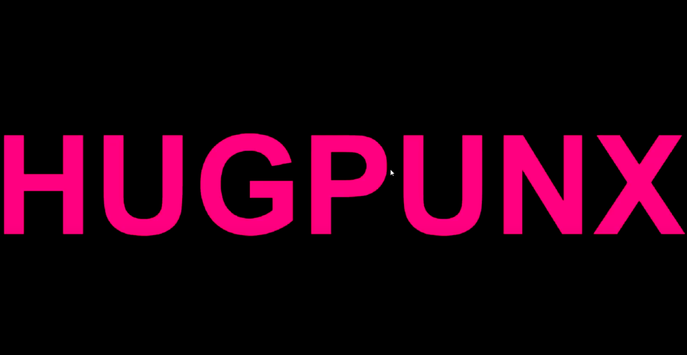
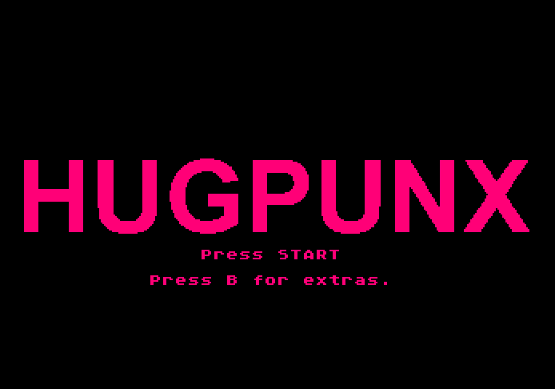
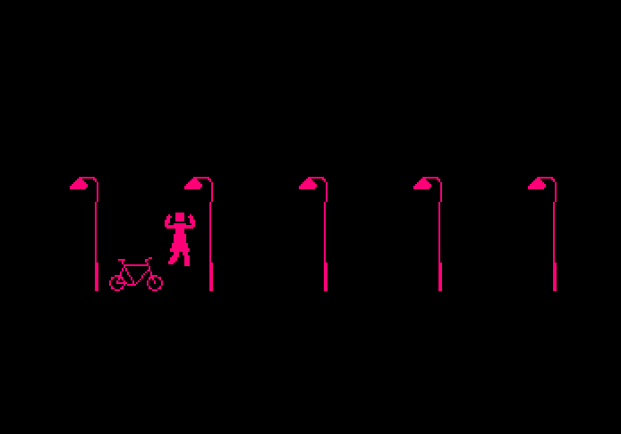
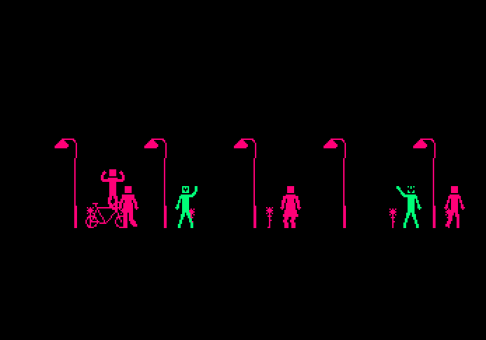
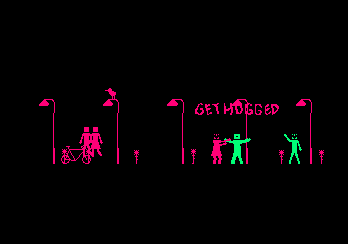
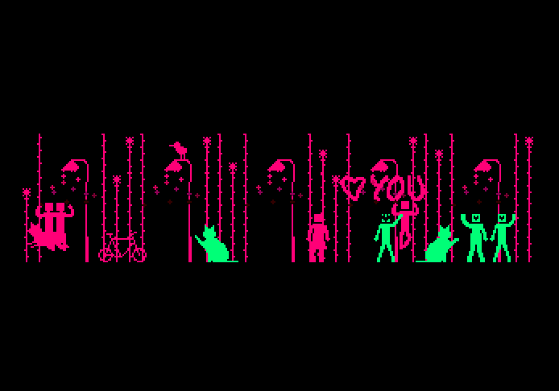
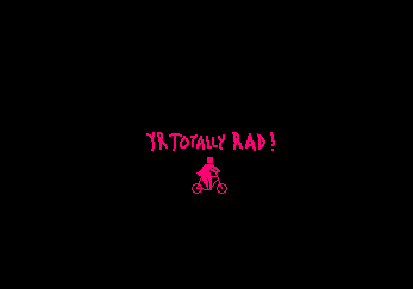
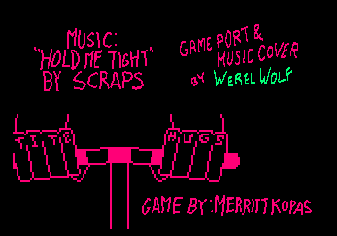

# HUGPUNX V0.9  2022-10-31

Originally released in 2013, all online records of this game by Merritt Kopas have been removed save from some 3rd party Let's Plays on Youtube.

This is my take at recreating it for the Sega Genesis / Mega Drive, while learning the [**S**ega **G**enesis **D**evelopment **K**it](https://github.com/Stephane-D/SGDK) by Stephane Dallongeville in the process.

The playable ROM has been compiled and available in [out/rom.bin](./out/rom.bin) and all assets for DIY compilation are part of this repo.

##  Known Bugs

- Only plays in emulator (BlastEm)
- Opening ring sfx renders choppy
- Mis-aligned tiles flash with changing BG planes
- Intro animation skews on left (hardware bug)
- Character control is not smooth (movement can stop)
- Soundtrack port is not complete
- Credits glitch with each image change

## Credits

Game credit to Merritt Kopas.

Music credit 5crap5 - Hold Me Tight

Sonic Ring sound from SGDK Sample projects

Porting by recreating sprites, game logic, sound, and hugs by Tim Schmidt aka Werel Wolf

##

Aseprite, Deflemask, and VSCode were my primary tools for this project.

I will likely not persue this project any farther.  I have invested enough time to see that it exists and my ambition has migrated to other interests.

## Gameplay

This is HUGPUNX for SEGA Genesis
